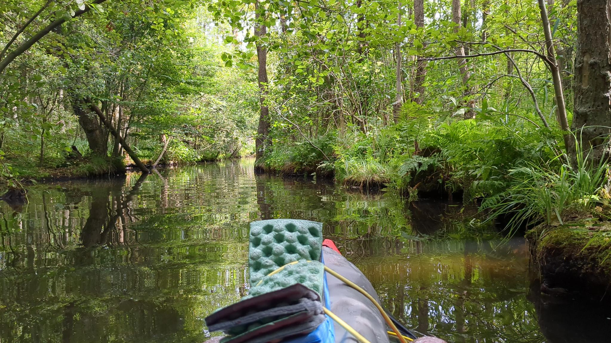
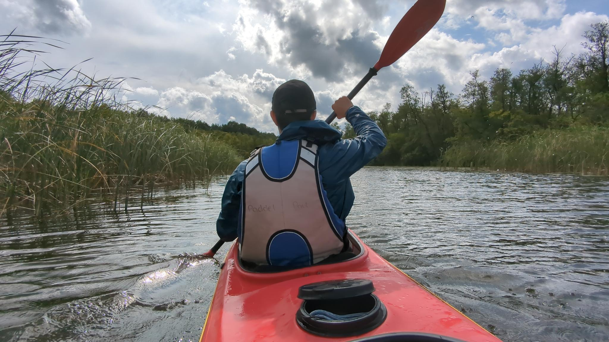
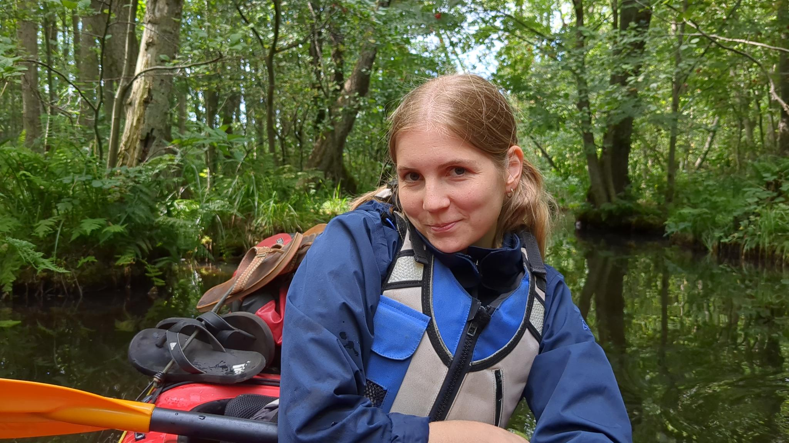
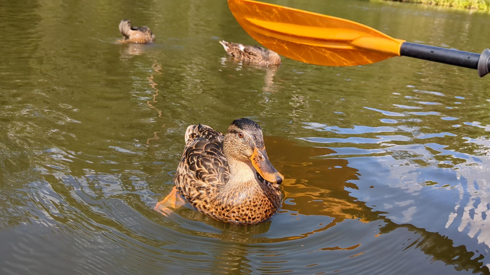

import { Image } from 'astro:assets'
import slide1 from '../../assets/default.jpg';

Während man ein Kajak morgens  startbereit macht, hat man viel Zeit zum nachdenken. Genauso ist es abends beim Auspacken und Zeltaufbau auf einem neuen Campingplatz. 

Diese beiden Zeiträume des Einpackens und Auspackens erinnerten mich heute an geistliche Übungen des Ignatius von Loyola. Von den Jesuiten kenne ich vor allem den ignatianischen Tagesrückblick, in dem es oft in den Anleitungen heißt, man solle sich den vergangenen Tag wie einen Koffer voller Momente vorstellen, den man zu Beginn oder am Ende eines Tages noch einmal vor sich auspackt. Ich habe heute Morgen beim Einpacken meiner Sachen an die Momente dieser Nacht gedacht. Im Grunde hätte sie eine  ruhige und erholsame Nacht unter sanft rauschenden Bäumen sein können - aus starker Übermüdung meinerseits wurde sie jedoch in meiner Erinnerung eine Nacht mit hundert Mückenstichen und panischer Angst vor herabfallenden Ästen durch einen etwas stärkeren Windgang. Das ging so weit, dass ich Pablo mitten in der Nacht weckte, um das Zelt an einen Baum-freien Ort zu verlegen. Sobald es wieder hell war, konnte ich beim besten Willen nicht mehr verstehen, wie mich dieses leichte Säuseln der Bäume so in Panik versetzen konnte! Erstaunlich, welche Wandlung Eindrücke durchlaufen können - je nachdem, ob sie im Halbschlaf bei Nacht oder erholt bei Tag wahrgenommen werden. "Deswegen rate ich ja: blicke noch einmal auf jeden Tag zurück (und überlege, wo du Gott gespürt hast)!", würde Ignatius darauf wahrscheinlich antworten.

Und welche Momente gab es nun am Ende des heutigen Tages, auf die ich zurückblickte? Stille Fahrten durch winzige Bäche, über die sich Baumwipfel und Farne bogen, wie man es sich auf dem Amazonas vorstellt! Die Entdeckung eines alten, mystisch wirkenden und mittlerweile verlassenen Gutshauses - daneben ein ehemaliges Zirkuszelt, in das man einfach hineingehen konnte. Und schließlich kamen wir an einem lauschigen Campingplatz in Wustrow an (ich wusste davor auch nicht, dass ein Campingplatz lauschig sein kann - aber dieser ist es!!). Wustrow selbst könnte die ideale Filmkulisse für einen Lokalkrimi sein!

Wie bei jedem ignatianischen Tagesrückblick fällt mir schließlich auf: der Koffer ist voller als gedacht!
