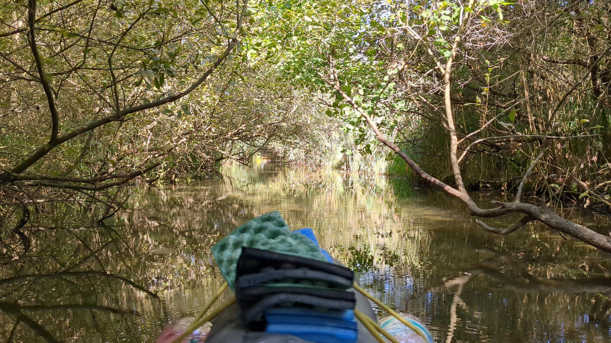

import { Image } from 'astro:assets'
import slide1 from '../../assets/selfie.jpg';

Aufgrund eines langen, aber überaus zufriedenstellenden Tages nur folgende drei Erkenntnisse als Fazit:

1. Mit einem winzigen Kajak zwischen Motorbooten eine Schleuse zu passieren ist im Unwissen, was einen erwartet, zunächst etwas beunruhigend - dann fühlt sich die Umschleusung jedoch ein wenig wie Fliegen an.

2. Professionelles Aussehen beim Paddeln hat wenig damit zu tun, wie schnell man vorankommt...wir versuchen seit Tagen, unsere Paddel-Technik zu perfektionieren und wurden heute trotzdem von viel zu entspannt wirkenden Anfängern überholt.

3. Manche Teile von Deutschland können definitiv mit Werbebildern für Touren in Kanada konkurrieren.

[kajak](../../assets/kajak.jpeg)
