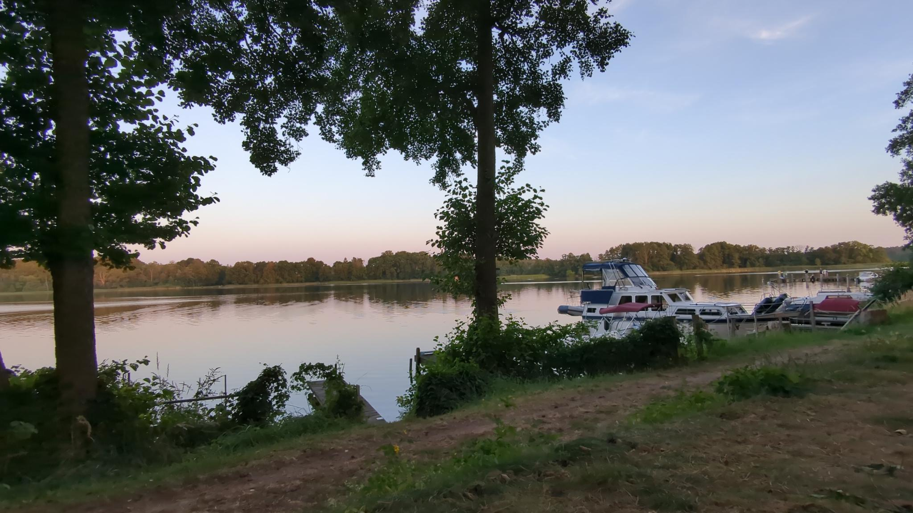

Wind und Wetter standen bei der heutigen Fahrt prinzipiell auf unserer Seite - im Gegensatz zur Tour am ersten Tag wehten uns starke Windböen so stark in den Rücken, dass es geradezu schwer  war, überhaupt von sich aus das Gefühl zu haben, noch viel zur Geschwindigkeit des Bootes beizutragen. Die Sonne meint des dagegen eher zu gut mit uns. So kamen wir an unserem letzten Stopp vor der morgigen Ankunft an unserem Kajakverleih trotzdem völlig fertig an. Das sorgt auch beim heutigen Eintrag für eine Trockenzeit hinsichtlich Kreativität...

Man muss in diesem Sinne einen Urlaub auch Urlaub sein lassen und anerkennen, dass ein Kopf nicht mehr die interessantesten Berichte schreibt, nachdem er sechs Stunden der Hitze ausgesetzt war. Wir nehmen uns insofern Donald Duck in seiner geliebten Hängematte zum Vorbild für den heutigen Abend. 
(Anmerkung für die kommenden zwei Tage: die Abreise nach der Ankunft beim Kajakverleih wird voraussichtlich sehr beanspruchend, weshalb wir wohl den Blog erst daran anschließend mit einer Reflexion schließen werden)

